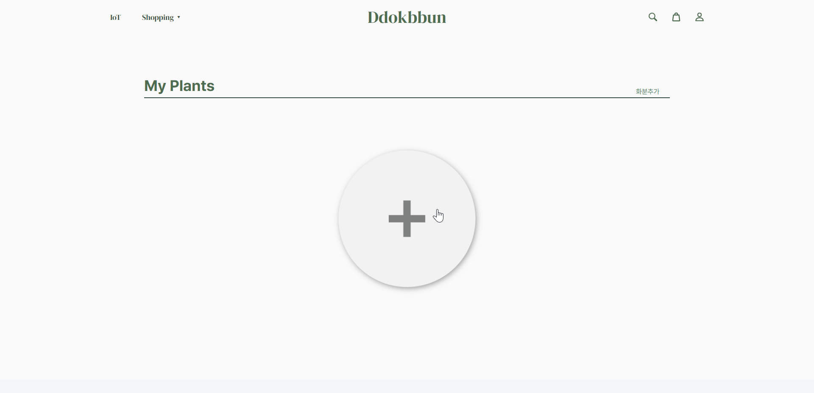
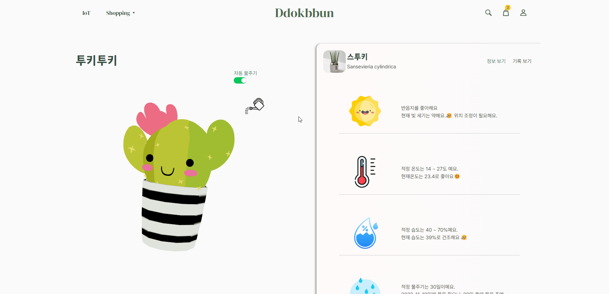
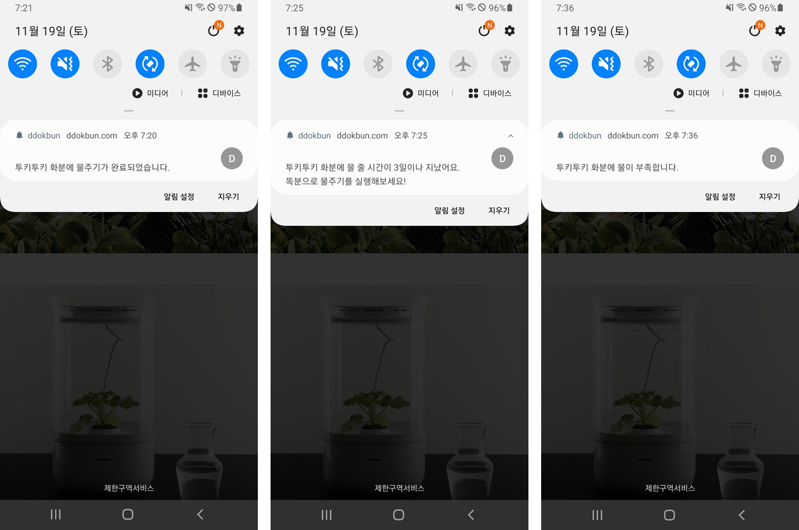
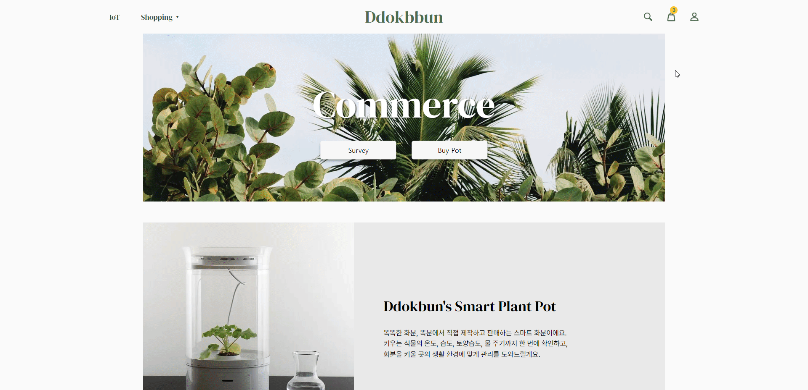
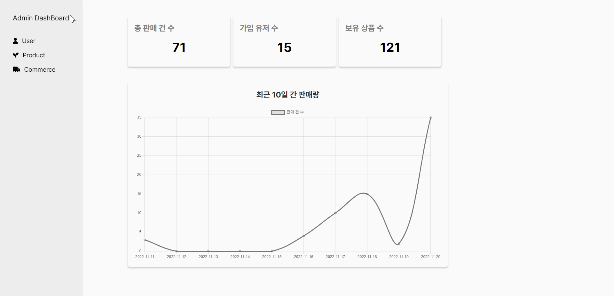
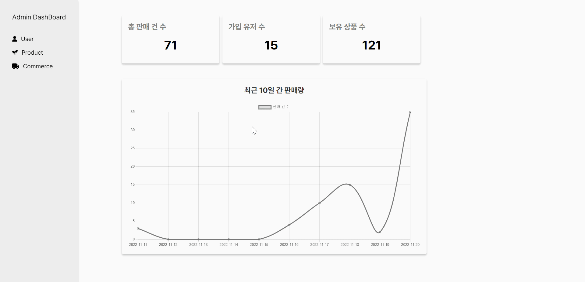

#  &nbsp; DDOKBUN - IoT 화분 관리 및 식물 E-커머스 플랫폼

> <h3> 똑똑한 화분, 똑분이


<br>

## 🪴 **Introduce**

> **DDOKBUN**은 스마트 화분을 통해 식물 관리 서비스를 제공하고, 식물, 화분을 판매하는 E커머스 플랫폼입니다.<br>
> 사용자는 본인의 LIFE 스타일에 맞게 식물을 추천받을 수 있으며, 화분 관리 시스템을 통해 효율적으로 식물을 관리할 수 있습니다.

<br>

## 🎥 **소개 영상**

- [UCC 바로가기]()

<br>


## 🕘 **프로젝트 진행 기간**

-  **2022.10.10(월) ~ 2022.11.18(금)**

<br>


## ☃️ **Team**
<table>
 <tr>
    <td align="center"><a href="https://github.com/Jaehwany"></td>
    <td align="center"><a href="https://github.com/Jaehwany"></td>
    <td align="center"><a href="https://github.com/Jaehwany"></td>
    <td align="center"><a href="https://github.com/Jaehwany"></td>
    <td align="center"><a href="https://github.com/Jaehwany"></td>
    <td align="center"><a href="https://github.com/Jaehwany"></td>
  </tr>
  <tr>
    <td align="center">팀장, Frontend</td>
    <td align="center">Frontend</td>
    <td align="center">Frontend</td>
    <td align="center">Backend</td>
    <td align="center">Backend</td>
    <td align="center">Backend</td>
  </tr>
     <tr>
    <td align="center"><a href="https://github.com/"><sub><b>신혜원</b></td>
    <td align="center"><a href="https://github.com/"><sub><b>김채리</b></td>
    <td align="center"><a href="https://github.com/"><sub>허건녕</b></td>
    <td align="center"><a href="https://github.com/"><sub><b>손광진</b></td>
    <td align="center"><a href="https://github.com/"><sub><b>이동욱</b></td>
    <td align="center"><a href="https://github.com/"><sub><b>이재환</b></td>
  </tr>

</table>
     
<br>     

## 📍 PPT

- **[중간 발표 PPT]()**  
- **[최종 발표 PPT]()**
<br>


## 🧾 프로젝트 산출물

- [ERD]()
- [API 명세서]()
- [와이어프레임]()
- [포팅 매뉴얼]()
<br>   


 ## ✔️ 주요 기능

#### IoT 스마트 화분

+ **스마트 화분(Ddokbun)**

  + 아두이노, 라즈베리파이로 자체 제작한 스마트 화분
  + Kafka를 활용하여 자동물주기, 데이터 관리, 추천 등의 기능 제공

  

+ **데이터 수집** **/ 데이터 시각화**

  + 이용자의 스마트 화분 환경에 대한 토양 습도, 광량, 온도, 습도 데이터 수집
  + Spark를 활용하여 사용자 데이터를 분산처리
  + 수집된 데이터를 Chart.js를 활용하여 이용자가 한눈에 보기 쉽게 시각화

  

+ **자동 물주기**

  + Kafka Broker에 메시지를 발행
  + Topic에 대한 레코드로, 아두이노와 통신
  + FCM을 이용해 사용자의 기기에 알림 전송

  

+ **스마트화분 기반 추천**

  + 이용자의 스마트 화분 데이터를 활용한 데이터 분석을 통하여 사용자 환경에 적합한 식물 추천
  + 분산처리된 데이터를 바탕으로 전처리 및 벡터라이징. Sikit-Learn을 활용한 머신러닝을 바탕으로 식물 추천

  

+ **디지털 트윈**

  + Three.js 를 활용하여 이용자의 식물을 디지털 트윈화
  + 물 주는 동작을 애니메이션화하여 식물에게 물을 줄 때 사용자와 상호작용 증가

  

#### **커머스**

+ **필터링 / 설문조사 기반 추천**
  + 총 4가지 키워드를 바탕으로 적합한 식물 정보를 제공
  + 초보집사 / 집꾸미기 / 반려동물 / 공기정화 
  + 설문조사 내용을 바탕으로 필터링하여 사용자에게 적합한 식물 추천


+ **관리자페이지**
  + 관리자 페이지를 통해서 이용자 배송상태 관리
  + 유저 권한 관리 및 유저 정보 관리
  + 판매 현황 제공 및 판매량 데이터 시각화


+ **결제(카카오페이)**
  + 카카오 페이 API를 활용한 결제 시스템
  + 모바일 / 웹을 구분하여 디바이스에 적합한 시스템으로 결제


​     

## &#128215; 아키텍처


     
<br>   <br>

## &#128216; 기술 스택


<br>   <br>

## &#128217; 개발 환경
<br>

- FrontEnd
   - JavaScript ES6
   - Typescript
   - React 18
   - Next.js 12
   - Next PWA
   - Next SEO
   - Redux-toolkit / Redux-wrapper / Redux-persist
   - Styled-Components
   - Tailwind
   - Three.js
   - Chart.js
   - Framer-motion
   - Axios
   - Firebase
   - ESLint
   - Prettier

- BackEnd
   - Spring Boot 2.7.5
   - Spring Data JPA
   - Spring Security
   - Java 11
   - QueryDSL
   - Firebase
   - Redis
   - Kafka
   - MySQL
   - Spark
   - Yarn
   - YOLO v5
   - Scikit Learn
   - Pytorch

- IoT
   - Rasbian

- CI/CD
   - AWS EC2
   - Docker
   - Jenkins
   - nginx
   - certbot

- IDE
   - VS Code
   - IntelliJ
   - MySQL Workbench 8.0

<br>


 ## &#128187; 서비스 화면

<br>

### 1. Onboarding

+ 똑분 서비스만의 차별점과 사용 방법을 파악할 수 있도록 하였습니다.
- SEO 타이틀 페이지로서, 처음 유저와의 접점 시 긍정적인 인식을 줄 수 있도록 서비스 이미지에 대한 시각자료를 제공하며, 플랫폼 브랜딩을 기획하였습니다.


### 2. IoT

#### 화분 선택

+ 내가 가진 화분을 캐러셀 형태로 확인할 수 있으며 내가 가진 화분의 정보를 바탕으로 새로운 식물을 추천받을 수 있습니다.
+ 화분데이터가 충분하지 않을 경우 설문조사 / 카테고리 기반 추천으로 새로운 식물을 추천받을 수 있도록 유도하였습니다


#### 화분 추가

+ 식물 검색기능을 활용하여 내가 가진 식물의 정보를 불러올 수 있도록 하였습니다.
+ 자신만의 식물이름을 지정하여 식물 닉네임기반으로 관리 할 수 있도록 하였습니다.

 


#### 화분 관리

1. **디지털 트윈**

   - Suspense와 Lazy Loading을 활용하여 Three.js의 성능을 개선하여 UX를 향상시키고자 하였습니다.
   - Three.js를 활용하여 나의 식물을 3D식물 캐릭터로 렌더링했고, 사용자와 인터랙션 할 수 있도록 하였습니다.
   - 물주기 버튼을 활용하여 IoT 식물에게 물을 줄 수 있도록 하였고, 물 주는 동안 애니메이션을 실행하여 사용자에게 물을 주고 있다는 것을 확인할 수 있도록 하였습니다.
   - 자동 물주기 설정 시 DB에 저장되어 있는 식물 정보 바탕으로 물을 주도록 할 수 있고, 또는 사용자가 설정한 날짜에 맞춰 물을 줄 수 있도록 하였습니다.

   

1. **데이터 시각화**

   + 내가 키우고 있는 식물의 정보를 보여주어 사용자가 식물을 기를 때 도움이 될 수 있도록 하였습니다.
   + 기록보기를 통해 IoT화분을 통해 언제 물을 주었는지 달력으로 확인할 수 있도록 하였습니다.
   + IoT화분을 활용하여 온도 / 조도 / 습도 / 토양습도에 데이터를 시각화 하였고, 사용자가 볼 수 있도로 하였습니다.





#### 푸쉬알림

+ 화분에 물 주기가 완료 됐을 때, 물 줄 시간이 지났을 때, 화분 물통에 물이 부족할 때 이용자에게 푸쉬알람 제공합니다
+ Firebase를 활용하여 백그라운드에서 실행되고 있지 않을때에도 작동하여 식물관리에 도움을 줄 수 있도록 하였습니다.




### 3. Commerce

#### 커머스 홈

+ 배너를 활용하여 커머스의 다양한 기능에 이용자들이 쉽게 접근할 수 있도록 하였습니다.
+ 조회수 기반 인기식물을 보여주어 이용자들이 인기있는 식물을 확인할 수 있도록 하였습니다.
+ 카테고리 바로가기 외에도 추천 상품을 보여주며 플랫폼이 유기적으로 연동될 수 있도록 하였습니다.


#### 상품 목록

+ 약 200여종의 식물을 초보집사 / 집꾸미기 / 반려동물 / 공기정화 네가지 카테고리로 분류하여 사용자들이 자신의 목적에 맞는 상품을 구매할 수 있도록 유도하였습니다.
+ 애니메이션을 활용하여 부드러운 효과를 주었습니다.
+ 상품카드에 마우스가 올라갈 시 애니메이션 효과를 주어 상호작용을 추가하였습니다


####  상품 디테일

+ 카드를 활용하여 식물에 대한 요약정보를 제공하였습니다
+ 상품 디테일 화면에서 바로구매하거나 장바구니에 담을 수 있도록 하였습니다.
+ 유사 상품을 캐러셀 형태로 사용자에게 제공하여 다른 상품도 추천할 수 있도록 했습니다.


#### 설문조사 기반 추천

+ 설문조사를 바탕으로 필터링하여 사용자에게 맞는 식물을 추천하였습니다.
+ forwardRef.focus를 활용해 다음질문으로 넘어가게 하여 UX를 향상시키고자 하였습니다.
+ 필터링한 정보를 바탕으로 식물을 추천하였고, 카드를 재사용하여 생산성을 높였습니다. 


#### 장바구니/ 주문

+ Redux를 활용하여 새로고침 없이도 장바구니 정보가 갱신되도록 하였습니다.
+ 장바구니 페이지에서 수량을 조절하고, 삭제할 수 있도록 하였습니다.
+ 유효성검사를 통해 사용자가 올바른 결제정보를 입력하도록 하였습니다.




#### 결제

+ 사용자가 웹으로 접속했는지, 모바일로 접속했는지 구분하여 모바일일 경우는 카카오페이를 바로 실행할 수 있도록, 웹일 경우 QR / 인증번호 결제를 할 수 있도록 구분하였습니다.
+ 결제를 진행할 때 DB에 결제 대기상태를 기록 한 후, 결제가 성공적으로 끝나면 결제상태를 결제완료로 변경합니다.


#### 마이페이지

+ 커머스의 나의 결제정보와 배송정보를 확인할 수 있고, 나의 식물정보를 확인할 수 있는 페이지입니다.
+ 테이블을 활용하여 결제 및 배송 상태별 식물들을 조회할 수 있게 하였고, 컴포넌트를 재사용하여 생산성을 높였습니다.


#### 검색(모바일)

+ 태그별 식물 검색이 가능하도록 하였습니다.
+ 검색어 필터링을 활용하여 현재 검색어와 유사한 상품이 결과창에 나올 수 있도록 하였습니다
+ AI 딥러닝을 활용하여 이미지 검색을 할 수 있도록 하였습니다. 사용자가 카메라나 이미지 파일을 활용하여 식물 사진을 검색한다면 그와 가장 유사한 식물이 결과값으로 나오도록 하였습니다


### 4. Admin

#### 커머스 관리

+ 커머스 이용자들의 구매내역을 관리하고 배송상태를 관리 할 수 있도록 하였습니다.
- 결제 상태를 버튼을 활용하여 쉽게 배송상태를 변경 할 수 있도록 하였습니다.
- 전체 대시 보드 중, 주문 건수에 대한 차트를 제작해 주문량을 한 눈에 볼 수 있습니다.




#### 유저 관리

+ 유저들의 정보를 테이블로 관리하여, 파악이 용이하도록 하였습니다.
- 유저별 접근 권한을 다르게 부여하고, 이를 변경할 수 있는 기능을 제공합니다.


#### 상품 관리

- 보유한 상품에 대해 테이블로 관리 할 수 있도록 하였습니다.
- 상품의 남은 재고를 확인하고, 삭제할 수 있습니다.




## &#128218; 프로젝트 파일 구조


### Frontend

```
frontend
  ├── apis
  ├── assets
  │    ├── commerce
  │    ├── fonts
  │    ├── icon
  │    └── onboarding
  ├── common
  │    ├── Button
  │    ├── Cards
  │    ├── Carousel
  │    ├── DatePick
  │    ├── Dot
  │    ├── GetPostsModal
  │    ├── Graph
  │    ├── Input
  │    ├── Labels
  │    ├── Login
  │    ├── Modal
  │    ├── NavCard
  │    ├── Navbar
  │    ├── PageTitle
  │    └── Spinner
  ├── components 
  │    ├── Flower
  │    ├── admin
  │    ├── commerce
  │    ├── manage
  │    ├── mypage
  │    ├── search
  │    └── welcome
  ├── pages
  │    ├── admin
  │    ├── commerce
  │    ├── login
  │    ├── manage
  │    ├── manage/[userseq]
  │    ├── search
  │    ├── test
  │    └── welcome
  ├── public
  │    ├── icons
  │    └── models
  ├── store  
  ├── styles
  │    ├── animations
  │    ├── commerce
  │    ├── manage
  │    ├── manage/[userseq]
  │    ├── search
  │    ├── temp
  │    └── welcome
  ├── types
  │    ├── admin
  │    ├── commerce
  │    └── search
  └── utils


```

### Backend

```
backend
  ├── ddokbun-batch
  │   ├── conf
  │   └── run
  ├── ddokbun
  │   ├── api
  │   ├── config
  │   ├── domain
  │   │   ├── ai
  │   │   │   ├── dto
  │   │   │   └── service
  │   │   ├── alarm
  │   │   │   ├── dto
  │   │   │   ├── entity
  │   │   │   ├── repository
  │   │   │   ├── res
  │   │   │   └── service
  │   │   ├── auth
  │   │   │   ├── dto
  │   │   │   └── service
  │   │   ├── cart
  │   │   │   ├── dto
  │   │   │   ├── entity
  │   │   │   ├── repository
  │   │   │   └── service
  │   │   ├── order
  │   │   │   ├── dto
  │   │   │   ├── entity
  │   │   │   ├── repository
  │   │   │   └── service
  │   │   ├── plant
  │   │   │   ├── dto
  │   │   │   ├── entity
  │   │   │   ├── repository
  │   │   │   └── service
  │   │   ├── product
  │   │   │   ├── dto
  │   │   │   ├── entity
  │   │   │   ├── repository
  │   │   │   └── service
  │   │   ├── s3
  │   │   │   ├── dto
  │   │   │   └── service
  │   │   ├── survey
  │   │   │   ├── dto
  │   │   │   ├── entity
  │   │   │   ├── repository
  │   │   │   └── service
  │   │   └── user
  │   │   │   ├── dto
  │   │   │   ├── entity
  │   │   │   ├── repository
  │   │   │   └── service
  │   ├── exception
  │   ├── schedule
  │   └── utils
  │       ├── auth
  │       ├── fcm
  │       └── string
  └── ddokbun_consumer
      ├── env
      └── config
```

### IoT

```
iot
  ├── arduino
  └── raspberry
```

<br>
